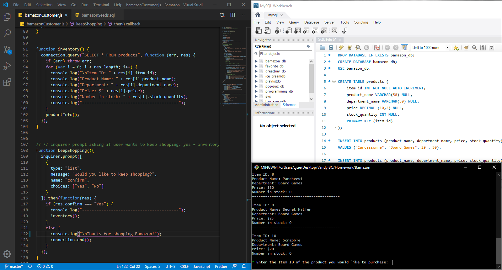

# Bamazon

Bamazon is a CLI node / mySQL project that mimics an Amazon like store front application. 

<li>My Goal with this project was to combine mySQL with node.js to perform CRUD operations into the database. </li>

<li>This project forced me to improve my understanding of the javascript logic with implementing if/else statements and basic use of mySQL workbench. </li>

<li>With this project being a CLI application, take a look at my demonstration video by clicking the image. Thanks for viewing my project!</li>

# Demonstration

# Technologies
<li>Node.js - (Javascript, if/else statements, for loops, modules</li> 
<li>mySQL node package - CRUD operations, my SQL workbench </li>
<li>Inquirer node package - User prompts</li>

# Future Development
<ol>Add Manager and Supervisor Options</ol>
<ol>Implement CLI table package</ol>
<ol>CLI styling</ol>
<ol>ES6 with console.log</ol>
